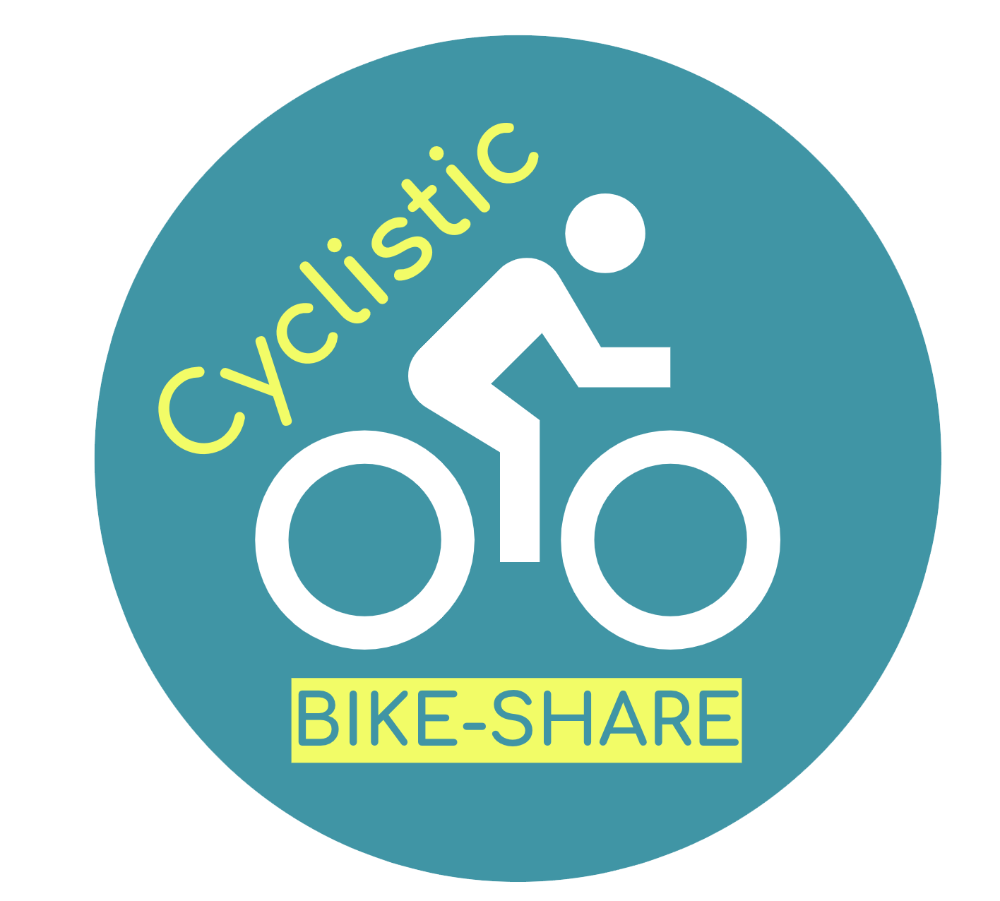

  

# Cyclistic Bike-Share Analysis  
### Google Data Analytics Capstone Project  
**By Spencer Cleland**

  
  
  
  
  

This repository contains my completed case study for the **Google Data Analytics Professional Certificate**.  
The project analyzes historical Cyclistic (Divvy) bike-share data to understand how **annual members** and **casual riders** use the service differently.  
These insights help support marketing strategies that aim to convert more casual riders into annual members.

---

## Business Task

> **Primary Question:**  
> **How do annual members and casual riders use Cyclistic bikes differently?**

The marketing team will use this analysis to shape targeted campaigns that encourage casual riders to purchase annual memberships.

---

## Repository Structure
cyclistic-customer-report-q1/
│
├── README.md
├── cyclistic_customer_report_q1.pdf # Final polished report
├── cyclistic_customer_report_q1.Rmd # Reproducible R Markdown analysis
│
├── data/
│ └── divvy_v2_clean.rds # Cleaned dataset used in analysis
│
└── plots/ # Exported visualizations
├── ride_length_histogram.png
├── rides_by_day.png
├── rides_by_hour.png
└── ...

---

**Raw Divvy datasets are NOT included** due to large file sizes and GitHub limitations.  
They are publicly available at:  
https://divvy-tripdata.s3.amazonaws.com/index.html

---

## Tools & Techniques

**Languages & Tools**
- R  
- RStudio  
- R Markdown  

**Libraries**
- tidyverse (dplyr, ggplot2, tidyr)  
- lubridate  
- kableExtra  

**Techniques**
- Data cleaning & standardization  
- Feature engineering (date/time components)  
- Exploratory data analysis (EDA)  
- Visualization using ggplot2  
- Non-parametric hypothesis testing (Wilcoxon test)  
- Reproducible reporting with R Markdown  

---

## Report Summary

**Q1 2019-2020 trip data reveals strong differences between annual members and casual riders:**
- Members: short, frequent commuting trips
- Casual riders: longer, leisure trips, concentrated on weekends
Understanding these differences provides a foundation for targeted membership marketing.

## Key Insights (At a Glance)
- Members use Cyclistic primarily for transportation
- Casual riders use it primarily for recreation
- Commute patterns vs. leisure patterns sharply divide usage

## High-Level Recommendations
1. Prioritize weekday vs. weekend analysis.
2. Explore trip purpuse.
3. Expand dataset beyond Q1 for future phases.

## Future Strategic Implications
- Membership marketing: target weekday-heavy riders
- Leisure-focused outreach: send campaigns on weekends
- Operational efficiency: align bike distribution with peak times by rider type

---

## Reproducibility

To reproduce this analysis:

1. Download the raw Divvy datasets from:  
   https://divvy-tripdata.s3.amazonaws.com/index.html  
2. Open `cyclistic_customer_report_q1.Rmd` in RStudio.  
3. Place the raw CSV files in a local `data_raw/` folder (optional).  
4. Knit the R Markdown file to generate the PDF report.  
5. The cleaned dataset (`divvy_v2_clean.rds`) is provided for convenience.

---

## Full Report

**[Click here to view the full PDF report](./cyclistic_customer_report_q1.pdf)**  
Includes detailed analysis, visualizations, interpretations, and final insights.

---

## License

This project is released under the **MIT License**.  
Divvy datasets remain governed by their separate public data license.

---

## Contact

**Spencer Cleland**  
If you’d like to discuss this project or other analytics work, feel free to connect!
